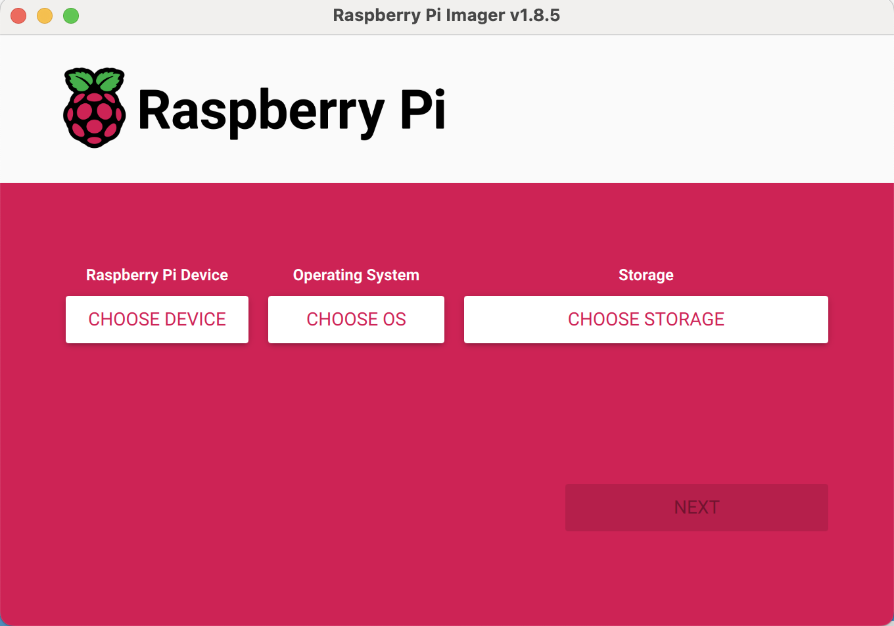
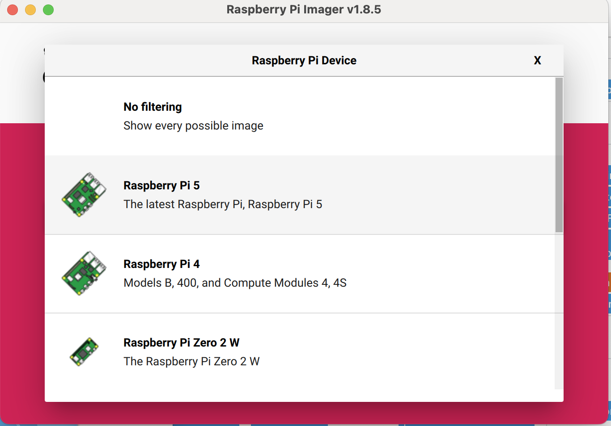
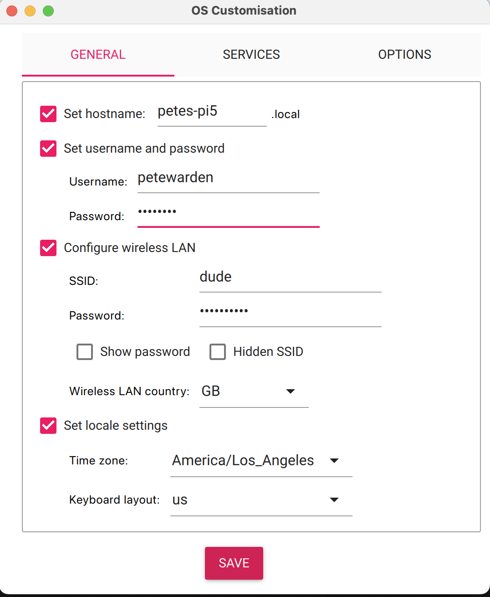
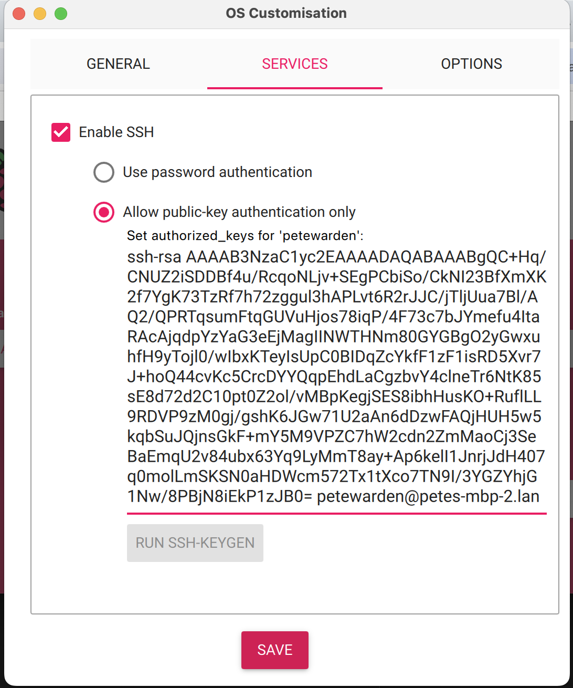
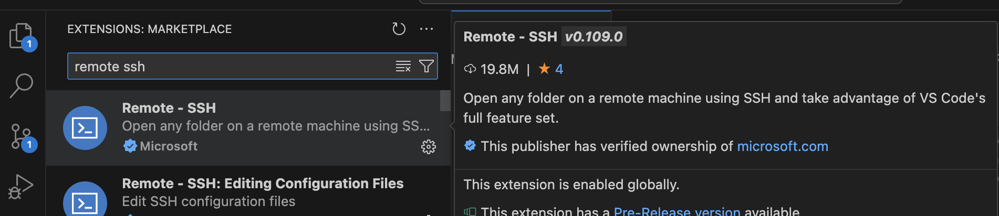
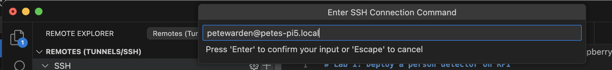
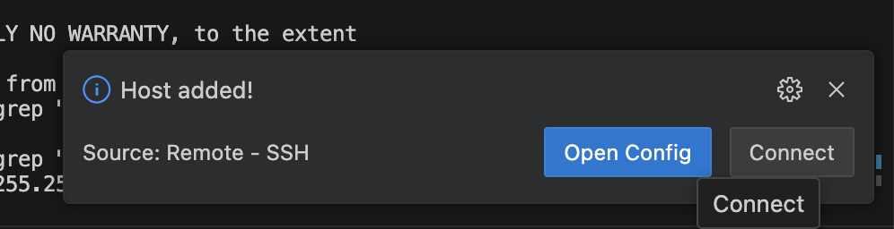
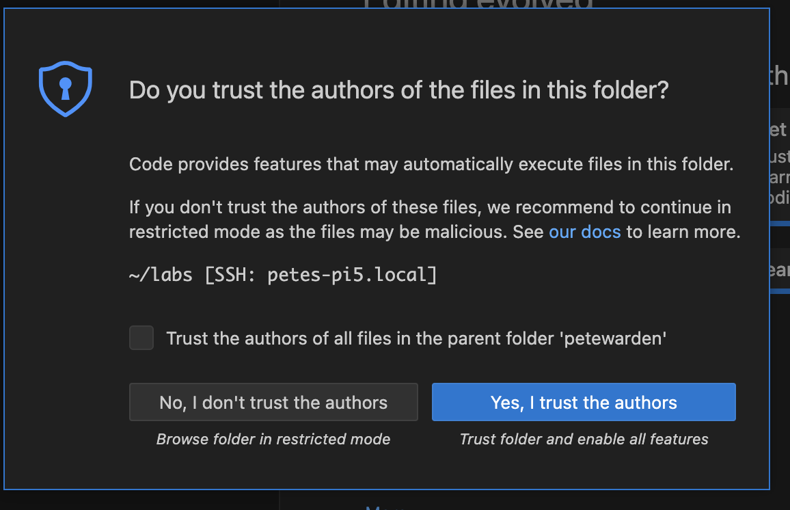

# Lab 0: Set Up Your Raspberry Pi

This tutorial shows how to set up your laptop and Raspberry Pi 5 board to run
future machine learning labs in EE292D.

## Hardware

You'll need the following pieces of equipment to complete this guide:

 - Raspberry Pi 5 8GB.
 - Raspberry Pi Camera.
 - Blank SD Card.
 - SD Card Reader.
 - Laptop.
 - USB Keyboard and Mouse.
 - HDMI Display.

The keyboard, mouse, and display are optional but recommended. If you're a
Stanford student on the course you will be provided with the equipment you
need, but for anyone else following along, here are links to the hardware we
purchased. You don't need these exact products, but I do find the starter packs
helpful since they usually include things like a power supply, HDMI adaptors,
and SD cards that can otherwise be confusing to find compatible versions of.

 - [Vilros Raspberry Pi 5 (8GB) Complete Starter Kit](https://www.amazon.com/dp/B0CTTJLV1B).
 - [Reiie H9+ Mini Keyboard and Touchpad](https://www.amazon.com/dp/B06X9J8NG4).
 - [Loncevon 7 Inch Mini Monitor](https://www.amazon.com/dp/B06XQJVXHL).

## Flash an SD Card

Raspberry Pis use an SD card as their default drive for storage and the
operating system. The first step to setting up your new board is to burn a new
card with an OS. I recommend picking a card with at least 32GB of space, and
preferably more if possible, since this is also where you'll put your working
files during development.

On your laptop, download the Rapsberry Pi Imager tool for your operating system from [raspberrypi.com/software/](https://www.raspberrypi.com/software/).

Insert an SD card into the laptop's reader.

Open the Imager tool.



Select "Raspberry Pi 5", "Raspberry Pi OS (64-bit)", and the reader device.




Press "Write" and choose "Edit Settings" on the dialog that appears.


On the default settings tab, choose a network name for your board (like 
<your name>pi5) and make a note of it, since it will be helpful for connecting
later.



Enter your preferred user name and password, and make a note of these too.

Enter the name and password of your Wifi network (or prefill it from the 
keychain).



Then go to the services tab and enable SSH. You've got a choice about how you
want to connect to the board. Choosing password might be simpler, but if you 
run ssh-keygen then you can log in from the laptop without having to type
anything. If you want to log in from other devices you'll have to add their ssh
keys too at a later stage.

Choose "Yes" to apply the settings, and "Yes" again to erasing any existing
data on the card.


Writing will take a few minutes. Once it's complete, take the card from the reader and insert it into the Raspberry Pi. Make sure the SD card is inserted so that 
its metal contacts are facing towards the board.

Plug the power supply into the wall, and then into the USB C plug on the 
Raspberry Pi. You should see a green LED near the USB C plug light up if it's
receiving power.

## Install VS Code

Go to [code.visualstudio.com/download](https://code.visualstudio.com/download)
and download the installer for your laptop's operating system. Follow the
instructions to install the application, and then open a new window.

## Remote login through SSH

Give the board a few minutes to boot, and then with your laptop connected to
the same Wifi network you entered into the Imager for the SD card, open a
terminal window in VS Code. You can do this by going to the main menu and
choosing "Terminal->New Terminal".

To make sure you can connect, type the following in the terminal, with the
name you gave to your Pi replacing 'petes-pi5', and the username you picked
instead of `petewarden` in the command:

```bash
ssh petewarden@petes-pi5.local
```

You should see a message like:

```bash
The authenticity of host 'petes-pi5.local (192.168.86.29)' can't be established.
```

This is normal for the first time you try to connect to a new host with SSH,
and you should reply 'yes' to the prompt.

If you chose to use a password, you should enter it when prompted, otherwise if you picked `ssh-keygen` during the SD card flashing, you'll be logged in automatically.

If all this is successful, you should see logs and a prompt, like this:

```bash
Linux petes-pi5 6.6.20+rpt-rpi-2712 #1 SMP PREEMPT Debian 1:6.6.20-1+rpt1 (2024-03-07) aarch64

The programs included with the Debian GNU/Linux system are free software;
the exact distribution terms for each program are described in the
individual files in /usr/share/doc/*/copyright.

Debian GNU/Linux comes with ABSOLUTELY NO WARRANTY, to the extent
permitted by applicable law.
Last login: Sun Mar 24 12:21:33 2024 from 192.168.86.28
petewarden@petes-pi5:~ $ 
```

## Troubleshooting Login Issues

Logging in remotely is one of the steps that's most likely to cause problems,
because there are so many variables that affect the process, from your laptop's
operating system, to the Wifi equipment, to the board itself. Here are some
techniques that can help fix common errors.

### Finding the Address of the Board

If you've plugged in your board, have seen the green LED light up, and have 
waited five minutes, but the `ssh` command either hangs or reports an error,
your laptop may be having trouble finding the board on the Wifi network.

To get a better understanding of what's happening, try the following command,
with `petes-pi5` replaced by the name you gave your board.

```bash
ping petes-pi5.local
```

If the board is at that network address you should see a stream of messages
like these:

```bash
PING petes-pi5.local (192.168.86.29): 56 data bytes
64 bytes from 192.168.86.29: icmp_seq=0 ttl=64 time=16.664 ms
64 bytes from 192.168.86.29: icmp_seq=1 ttl=64 time=29.753 ms
```

If this works then the network address isn't the issue, there must be a problem
with the ssh password or certificate.

If you see this message however, it means the board isn't at the address you
used:

```bash
ping: cannot resolve petes-pi5.local: Unknown host
```

If you do see this, and you have double-checked that you got the name of your
board correct and you're on the right Wifi network, you can try finding its
numerical IP address instead. To do this you first need to find the local
numerical address of your laptop. If you're on MacOS or Linux, here's a command
that should give you what you need:

```bash
ifconfig | grep 192.168
```

This should give something like this as its result:

```bash
        inet 192.168.86.28 netmask 0xffffff00 broadcast 192.168.86.255
```

As a next step, we're going to use the `nmap` network mapping tool to find all
the devices on the same network that have an open port ready to receive SSH
commands. The port number for ssh is 22, so you run the scan like this 
(replacing `192.168.86` with the first three numbers you found in your laptop's
IP address).

```bash
nmap -p 22 --open 192.168.86.0/24
```

This searches through all the numerical addresses on your local network, 
looking for any with open SSH ports. If the board is on the network, you should
see something like this as the output:

```bash
Starting Nmap 7.94 ( https://nmap.org ) at 2024-03-24 12:52 PDT
Nmap scan report for petes-pi5.lan (192.168.86.29)
Host is up (0.015s latency).

PORT   STATE SERVICE
22/tcp open  ssh

Nmap done: 256 IP addresses (9 hosts up) scanned in 18.11 seconds
```

There might be more than one address in the logs, and it might not report the
name of the device. You can try substituting any numerical IP addresses you've found into the ssh command, like this:

```bash
ssh petewarden@192.168.86.29
```

If any of them allow you to log in, then it's likely you've found the right
address, and you should note it down to use instead of the text address in
future commands.

If you're still unable to connect, you can troubleshoot some more once you
attach a monitor and keyboard. You won't be able to do remote login through
VS Code until you have ssh working successfully, but if you do have a display
you can open up the terminal on the board and enter the following command to 
get the Pi's IP address:

```bash
ifconfig | grep 192.168
```

If this doesn't work, try to load a website in the Chromium browser on the Pi
to make sure it's actually connected. If it isn't, try using the Wifi
connection tool in the top right of the menu bar to re-enter your network
details.

## Remote Login with VS Code

Once you have the ssh command working, you can set up the Remote SSH extension
in VS Code to easily edit files and run commands on the Pi from your laptop. To
set this up, open a new VS Code window and click on the Extensions icon in the
left sidebar. Search for "Remote SSH" and install the "Remote - SSH" extension
from Microsoft.



After it has installed, click the newly-added Remote Explorer icon on the
sidebar. When you mouse over the SSH heading, you should see a plus icon to the
right. 


Click on that, and type in the same address and username that you used 
to ssh into the Pi earlier. For example, if you were able to ssh in using the
command `ssh petewarden@petes-pi5.local`, you would enter 
`petewarden@petes-pi5.local` into the text field. 



You'll be asked if you want to update your SSH settings, and you should choose
the default location.


Once that's complete, you should see an option to connect to the host. Click 
it.



You should now see a new window appear. If you're using a password, you'll see
a prompt to enter your password at the top. Once you're logged in there should
be a few progress messages such as "Downloading VS Code Server". After they
complete, you should see a small connection message in the bottom left of the
window that says `SSH: petes-pi5.local`, but with your machine's name.


If that process worked, choose "Clone Git Repository..." from the options on
the start screen, and enter `https://github.com/ee292d/labs` when asked for the
URL. 


Choose your user's home folder as the destination (this will look like 
`/home/username` and should be the default choice). 


After it has downloaded, you'll be asked if you'd like to open the repository,
choose yes.


Then you'll be asked if you trust the authors of the repository, and you should
choose yes to enable all the VS Code features.



You should now be in a window that shows the contents of this repository in the
left-hand pane. If you choose "Terminal->New Terminal" from the menu you can
bring up a shell running on the board. You can now edit files and run commands
on the Pi directly from your laptop, which is often a lot easier than other
approaches to coding on the board.

## Connecting the Display and Keyboard

You can do a lot of things through VS Code's remote connection, but there are
some tasks, like troubleshooting network issues or displaying graphical 
outputs, that are easier to do from the Pi's own desktop.

Almost any HDMI-compatible display will work for a monitor, including a modern
TV if that's all you have. The Pi itself uses an unusual type of HDMI port, 
"HDMI Micro", so you'll need to make sure you either have a cable with one of
these on one end, and a full-size HDMI plug on the other, or an adaptor that
converts from Micro to regular, together with a standard HDMI cable. Most 
starter kits should include one of these adaptors, so check what you received
before you order a separate one.

To connect to the display, power down the Pi, plug in the HDMI cable to one of
the Micro HDMI ports on the board, and then power up the board again. The Pi
can often work when "hot swapping" a monitor, but I find the most reliable way
of getting a display working is ensuring it's connected and powered at boot
time.

#### Connect the Camera to the Pi


### Run an Image Labeling Model

#### Install TFLite

```bash
python3 -m pip install tflite-runtime
```

#### Make sure TFLite is Working

```bash
cd labs/lab1
python3 label_image.py
```
